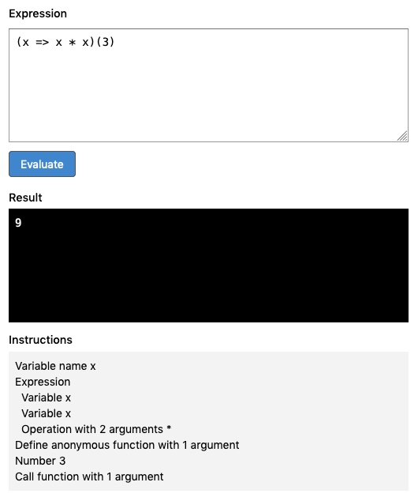

# Expreva

Expreva is a small language based on arithmetic and algebra expressions.



## Overview

The goal is to create a functional, extensible language with a Lisp-like simplicity.

This project started as a fork of [`expr-eval`](https://github.com/silentmatt/expr-eval), a mathematical expression evaluator that's been ported from C to JavaScript.  It's undergoing an extensive redesign to a minimal core of a parser and interpreter, so that most of the functionality can be built with the language itself.

## Develop

#### Install dependencies

```sh
yarn
```

#### Develop

Build, watch files and rebuild. This also starts a dev server with a page to test expressions.

```sh
yarn dev
```

Run tests and wait for user input to rerun.

```sh
yarn test
```

This can be run in parallel with `dev` task above (in another terminal process) for test-driven development.

Type-check, watch files and rerun.

```sh
yarn type
```

#### Build and minify

```sh
yarn build
```
