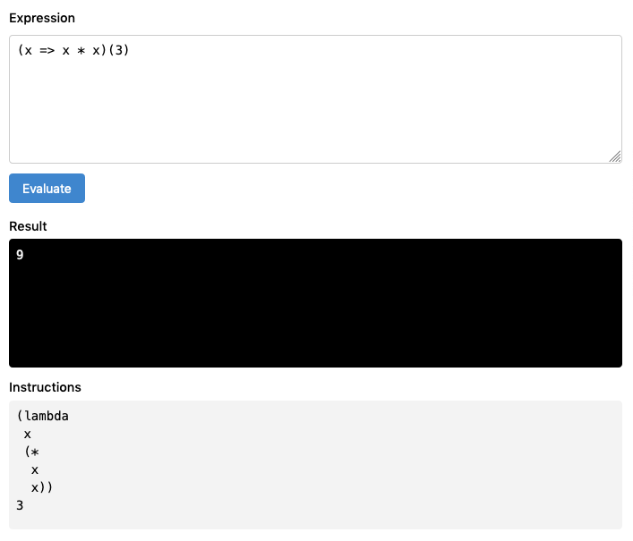

# Expreva

Expreva is a language based on arithmetic and algebra expressions.



## Overview

This is a parser and interpreter for the [Expreva language](https://expreva.com/), written in TypeScript.

Expreva is a modular, extensible language and cross-platform virtual machine.

It's an exploration in progress, to design a suitable medium for end-user programming - for example: in a spreadsheet formula; as a data transport or query protocol; and creation of dynamic content, such as hypertext documents and interactive textbooks.

The source code is compiled to a compact JSON-serializable format, suitable for transfer over HTTP, WebSocket, or inter-process communication.

The goal is to stay beginner-friendly, and simple enough to implement on a range of platforms. Currently it runs in a web browser, Node.js server, and on [PHP](https://github.com/expreva/expreva-php). An eventual plan is to compile to WebAssembly, and perhaps run on embedded devices.


## Parser

The default grammar is based on infix notation, a superset of familiar arithmetics.

The parser produces a syntax tree of symbolic expressions in prefix notation, as in Lisp.

#### References

- The original paper: [Top Down Operator Precedence - Vaughan R. Pratt](https://tdop.github.io/) (1973)
- How JSLint parses JavaScript: [Top Down Operator Precedence - Douglas Crockford](http://crockford.com/javascript/tdop/tdop.html) (2006)
- [Excellent overview of the algorithm, with examples in Python](https://eli.thegreenplace.net/2010/01/02/top-down-operator-precedence-parsing/) (2010)
- [Pratt Parsing and Precedence Climbing Are the Same Algorithm](https://www.oilshell.org/blog/2016/11/01.html) (2016)


## Interpreter

The interpreter is based on a study of [make-a-lisp](https://github.com/kanaka/mal), with lexical scope, lambda, macro, conditions, and tail-call optimization.

Compiled expressions are evaluated in an isolated runtime environment. It allows passing values, objects, and functions, to and from the host. **More work is needed to ensure safe evaluation**, such as limiting the number of operations and time to live.


## Develop

#### Install dependencies

```sh
yarn
```

#### Develop

Build, watch files and rebuild. This also starts a dev server with a test page.

```sh
yarn dev
```

Run tests and wait for press enter to rerun.

```sh
yarn test
```

This can be run in parallel with `dev` task above (in another terminal process) for test-driven development.

Type-check, watch files and rerun.

```sh
yarn type
```

#### Build and minify

```sh
yarn build
```
