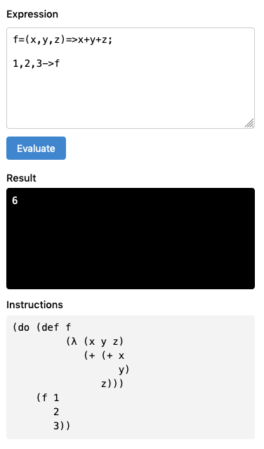

# Expreva

Expreva is a small language based on arithmetic and algebra expressions.



## Overview

This is a parser and interpreter for the [Expreva language](https://expreva.com/), implemented in TypeScript.

### Parser

The default grammar is based on infix notation, a superset of commonly used arithmetic statements.

The parser produces a syntax tree of symbolic expressions in prefix notation, as in Lisp.

- [Top Down Operator Precedence - Vaughan R. Pratt](https://tdop.github.io/)
- [Top Down Operator Precedence - Douglas Crockford](http://crockford.com/javascript/tdop/tdop.html)
- [The Shunting Yard Algorithm](https://en.wikipedia.org/wiki/Shunting-yard_algorithm#The_algorithm_in_detail)

### Interpreter

The interpreter is based on a port of [minimal-lisp](https://github.com/kanaka/miniMAL), with support for lexical scope, lambda, macro, conditions, and tail-call optimization.

## Develop

#### Install dependencies

```sh
yarn
```

#### Develop

Build, watch files and rebuild. This also starts a dev server with a page to test expressions.

```sh
yarn dev
```

Run tests and wait for user input to rerun.

```sh
yarn test
```

This can be run in parallel with `dev` task above (in another terminal process) for test-driven development.

Type-check, watch files and rerun.

```sh
yarn type
```

#### Build and minify

```sh
yarn build
```
